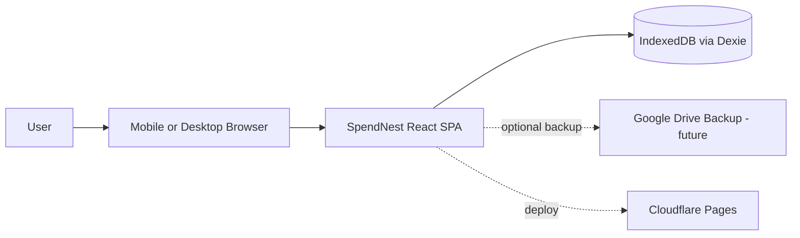
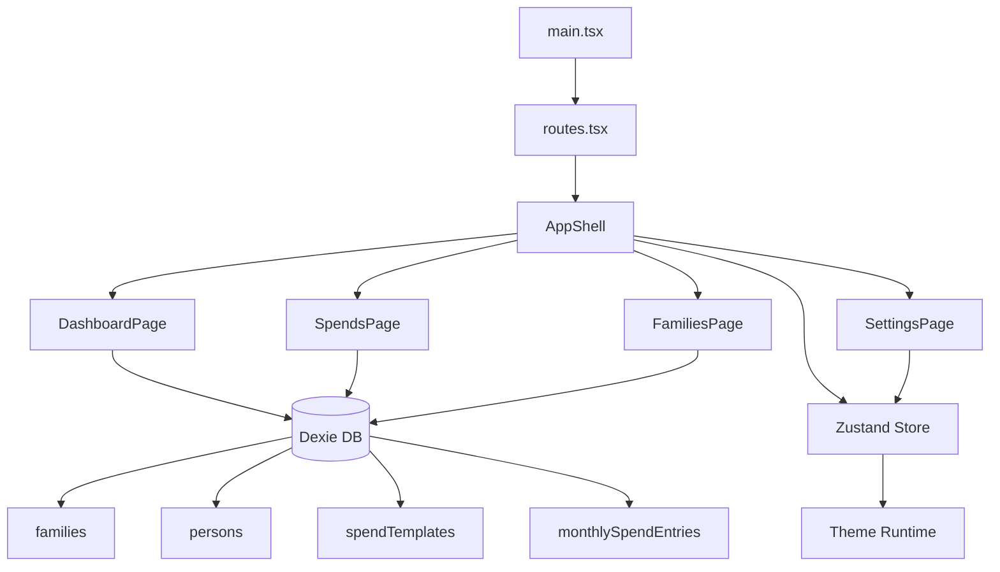
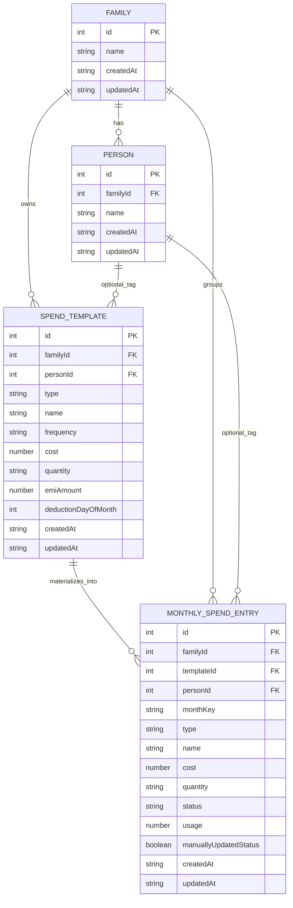
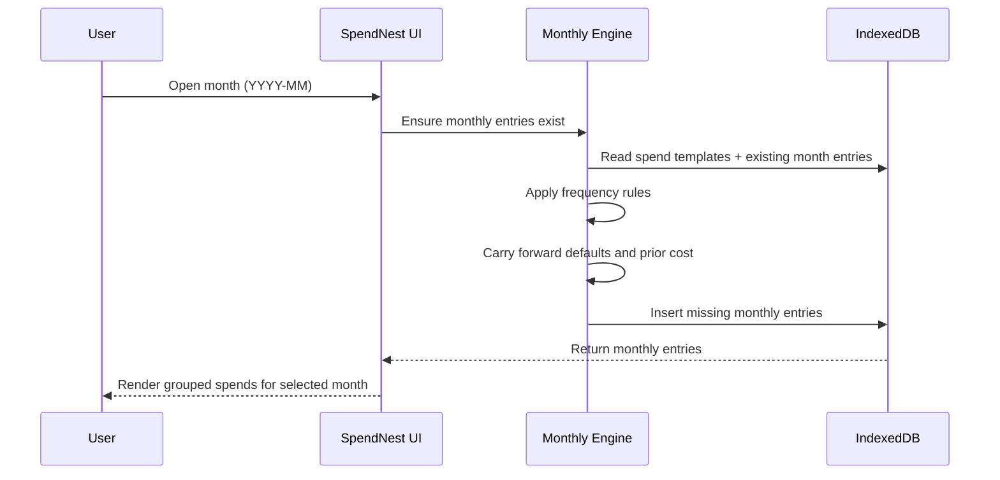
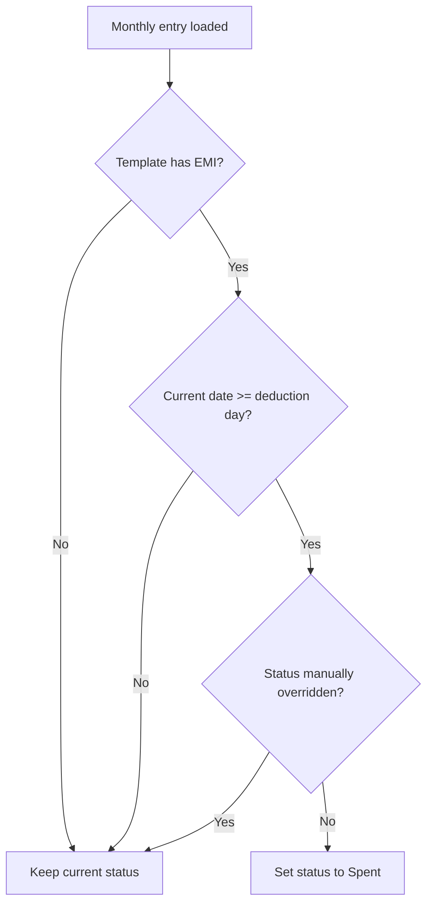
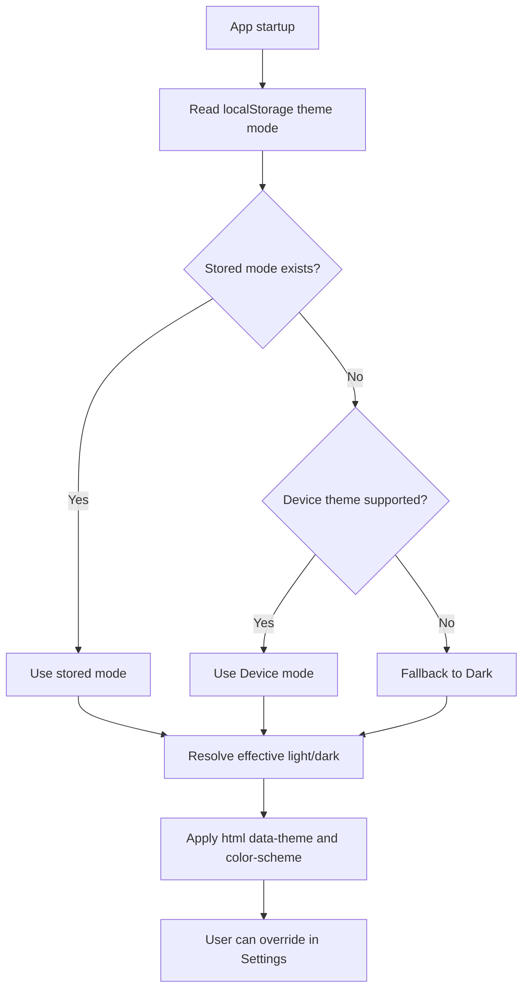

# SpendNest Design

## 1. Purpose
This document describes SpendNest architecture, data model, and key runtime flows.
It complements `docs/REQUIREMENTS.md` and should be updated when design decisions change.

## 2. System Context

## 3. Frontend Container View

## 4. Data Model (Logical)

## 5. Monthly Spend Lifecycle

Frequency rule details:
- `Monthly`: include on/after template `createdAt` month.
- `AdHoc`: include on/after template `createdAt` month.
- `Quarterly`: include when elapsed months from template `createdAt` month is divisible by `3`.
- `Annually`: include when elapsed months from template `createdAt` month is divisible by `12`.

## 6. EMI Auto-Toggle Flow

## 7. Theming Flow

## 8. Directory Strategy
Current baseline structure:
- `src/app` for shell, bootstrap, and route registration
- `src/features/dashboard` for dashboard route UI
- `src/features/families` for family route UI
- `src/features/spends` for spend route UI
- `src/features/settings` for settings route UI
- `src/features/not-found` for fallback route UI
- `src/features/theme` for theme types and runtime logic
- `src/shared/domain` for shared domain models
- `src/shared/db` for IndexedDB adapter
- `src/shared/state` for global app state

Ongoing strategy:
- Add new business capabilities under `src/features/<feature-name>`.
- Keep cross-feature primitives in `src/shared/*`.
- Propose and confirm large structural refactors before execution.

## 9. Design Constraints
- Local-first operation with IndexedDB persistence.
- Mobile-first responsive behavior with desktop support.
- PWA-first deployment model; optional Capacitor packaging later.
- Keep model and storage boundaries explicit so backup/restore and future sync remain straightforward.

## 10. Backup Format
- Export format: JSON file with `backupVersion: 1`.
- Payload includes: `families`, `persons`, `spendTemplates`, `monthlySpendEntries`.
- Import path validates JSON schema before restore.
- Current restore mode: replace existing local data (transactional clear + bulk restore).
