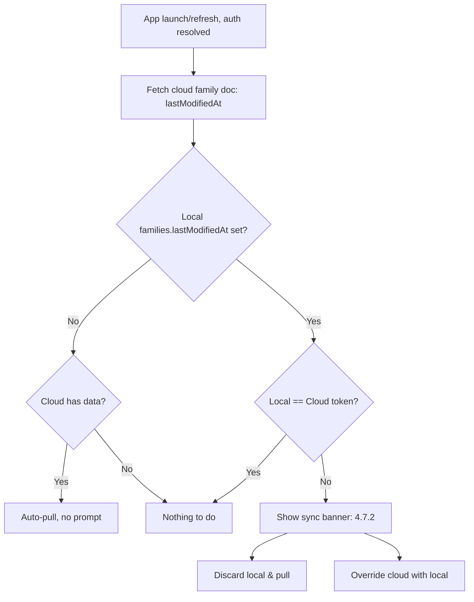
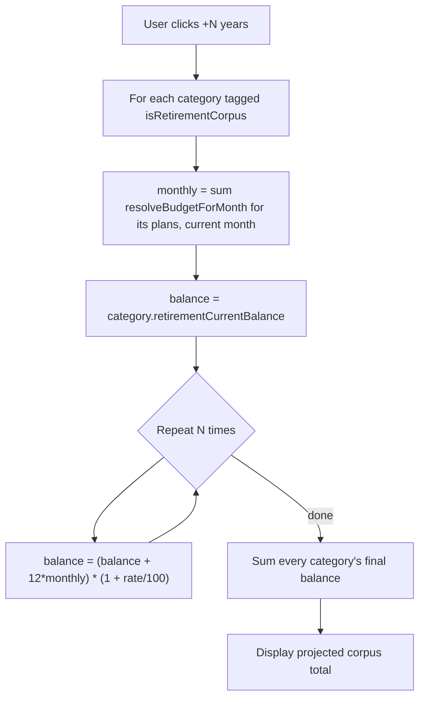
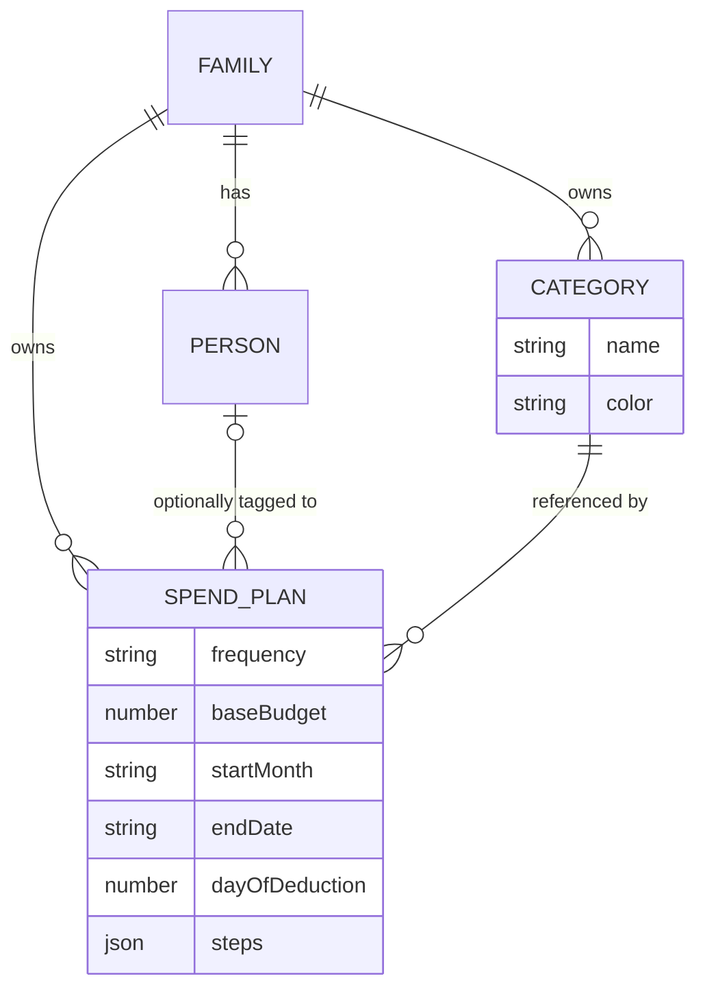

# SpendNest Requirements

## 1. Objective
SpendNest is a personal/family budgeting app focused on monthly spend tracking, recurring obligations, and simple analytics.

Primary goals:
- Track planned and ad-hoc spends by family/person.
- Reuse prior month spend templates without repetitive data entry.
- Give a clear monthly view of status and total expenditure.
- Keep data local-first and easy to back up/restore.

## 2. Product Strategy
### 2.1 Platform Strategy
- Build first as a responsive web app (PWA-capable) for mobile and laptop browsers.
- Host on Cloudflare Pages (free tier).
- Preserve architecture so the same React codebase can later be packaged via Capacitor for app-store publication.

### 2.2 Data Strategy
- Local-first persistence using IndexedDB.
- Export/import backups as initial safety mechanism.
- Add cloud sync using Firebase Firestore to support multi-device usage.
- Use Firebase Authentication with Google Sign-In for user identity/session.
- Keep IndexedDB as offline/local cache and sync with Firestore when online.
- Target audience is internal usage (~20-30 users), so design for low operational overhead and free-tier-first usage.

### 2.3 UX Strategy
- Mobile-first UI that scales to desktop.
- Fast month switching and low-friction status updates.
- Clear visual summary (budget breakdown bar chart + category pie chart + per-entry impact score).
- Built-in theme support for light and dark modes.
- PWA-installable with explicit in-app update prompt for home-screen users.

## 3. Scope
### 3.1 In Scope (MVP)
- Family and person management.
- Category management (add/rename/delete) in Settings, referenced by spend plans via `categoryId`.
- Spend plan creation and edit, including step-up/step-down amount history.
- Monthly spend view computed live from plans — no per-month persistence.
- Budget stat card and bar chart for the selected month's total resolved budget.
- Budget projection graph across past/future months.
- Retirement Corpus: per-category opt-in tagging with current balance + growth rate, and a +5/+10/+15/+20-year projection graphic on the dashboard.
- Spend card budget impact score (1–10 relative to filtered entries) with color indicator.
- Spend card sort controls (Cost ↓, Cost ↑, Category).
- Pie chart by spend category.
- Theming: `Light`, `Dark`, and `Device` preference mode.
- Responsive layouts for phone and desktop browser.
- Manual backup/restore (JSON/CSV acceptable for MVP).
- Google authentication (Firebase Auth, Google provider).
- Multi-device data sync via Firebase Firestore.

### 3.2 Out of Scope (MVP)
- Bank integrations and automatic transaction ingestion.
- Advanced forecasting, AI insights, or tax workflows.
- Multi-currency accounting complexity.

## 4. Functional Requirements
### 4.1 Family and Person
- User can create at least one family.
- A family can have one or more persons.
- A spend must belong to a family.
- A spend may optionally be tagged to one person in that family.

### 4.2 Spend Plan (formerly "Template")
Each spend plan supports:
- `categoryId` — a reference to a user-managed `Category` (4.2.1), not a free-text string. Renaming a category is instant everywhere a plan referencing it is displayed, since the plan stores only the reference.
- `name`
- `frequency` (`Monthly`, `Quarterly`, `Annually`, `AdHoc`)
- `baseBudget` — the plan's starting amount.
- `startMonth` (`YYYY-MM`) — cycle anchor for frequency eligibility.
- `endDate` (`YYYY-MM`, optional) — last month the plan is active. Generic to all frequencies (supersedes the EMI-only `emiEndMonth`).
- `dayOfDeduction` (1–31, optional) — day of month the amount is expected/auto-marked as deducted. Generic to all frequencies (supersedes `deductionDayOfMonth`, no longer EMI-only).
- `quantity` (free text, e.g., `5 Liters`, `10 Stocks`)
- `steps` — an array of step-up/step-down changes (see 4.3). This replaces per-month cost editing as the single mechanism for any amount change, permanent or one-off.

A spend plan does **not** store a per-month cost. Every month's amount is calculated from `baseBudget` plus `steps` (4.3).

#### 4.2.1 Category Management
Categories are managed in Settings, per family:
- `name` (required, unique within the family)
- `color` — assigned automatically from a fixed palette when the category is created; not user-editable, and stays fixed regardless of what other categories are added, renamed, or deleted afterward. This replaces the previous behavior of deriving a spend's color from its type string's alphabetical position among all currently-in-use types, which caused colors to reshuffle whenever the set of distinct types changed.
- User can **add** a new category, **rename** an existing one, and **delete** one.
- A category **cannot be deleted while any spend plan references it** — Settings shows how many plans use it and blocks deletion until they're reassigned to a different category or removed.
- Renaming a category is reflected immediately everywhere spend plans referencing it are shown (dashboard, spends list, pie chart, sort) — there is nothing to "propagate," since plans store a `categoryId` reference, not a copy of the name.

### 4.3 Step-Up / Step-Down Changes
Each plan carries a `steps` array capturing every amount change over its lifetime:
```ts
type StepChange = {
  effectiveDate: string; // YYYY-MM or YYYY-MM-DD — the cycle this change takes hold in
  amount: number;        // the new amount from this cycle onward (or for one cycle, if oneOff)
  oneOff?: boolean;       // true = applies only to the cycle containing effectiveDate, then reverts
}
```
- **Permanent change** (e.g., rent increases from ₹20,000 to ₹22,000 starting March 2026): add `{ effectiveDate: '2026-03', amount: 22000 }`. Applies from that cycle onward until superseded by a later step.
- **One-off change** (e.g., a usage-based electricity bill spikes to ₹3,500 one month): add `{ effectiveDate: '2026-06', amount: 3500, oneOff: true }`. Applies to that cycle only; the following cycle resumes whatever the permanent baseline would otherwise be. A variable/usage-based bill is modeled as a `oneOff` step for the actual amount each month it's known, with no permanent step needed.
- Resolution: to find the amount for a given month, take the latest permanent step with `effectiveDate` on/before that month's cycle (or `baseBudget` if none), then check whether a `oneOff` step targets that exact cycle — if so, use it instead for that month only.

```mermaid
flowchart TD
    A[resolveBudgetForMonth&#40;plan, monthKey&#41;] --> B{Is monthKey within<br/>startMonth..endDate<br/>and frequency-eligible?}
    B -- No --> Z[Not applicable this month]
    B -- Yes --> C[Find latest permanent step<br/>effectiveDate &le; monthKey]
    C --> D[baseline = step.amount<br/>or plan.baseBudget if none]
    D --> E{oneOff step targets<br/>this exact cycle?}
    E -- Yes --> F[Return oneOff.amount]
    E -- No --> G[Return baseline]
```



### 4.4 Monthly Spend View
- Spends are viewed by selected month (`YYYY-MM`).
- On opening a month, eligible plans are resolved entirely on-the-fly via `resolveBudgetForMonth` (4.3) — no monthly record is generated or persisted at all.
- Frequency eligibility rule (unchanged):
  - `Monthly`: eligible for every month on/after plan `startMonth`.
  - `AdHoc`: eligible for every month on/after plan `startMonth`.
  - `Quarterly`: eligible when elapsed months from plan `startMonth` is divisible by 3.
  - `Annually`: eligible when elapsed months from plan `startMonth` is divisible by 12.
  - All frequencies stop being eligible after `endDate`, if set.
- Nothing is persisted per month. There is no `MonthlySpendEntry` table, no status (`Spent`/`Not Yet`/`Skip`), no manual-override flag, and no usage tracking. The entire monthly view — including past months — is computed live from `SpendPlan` + `steps`.
- `dayOfDeduction` is retained on the plan purely as informational/display metadata (e.g., to show "due on the 5th" or to sort by due date within a month) — it drives no status change, since there is no status to change.

### 4.5 Dashboard and Reporting
- Budget panel shows the total resolved budget for the selected month as a stat card — sum of `resolveBudgetForMonth` across all eligible plans (this naturally includes Quarterly/Annually plans only in their billing month). There is no Spent/Pending breakdown, since actual-vs-planned is no longer tracked.
- Category pie chart shows resolved-budget distribution by category for the selected month, using each category's own fixed `color` (4.2.1) rather than a derived/positional palette.
- Each spend card displays a budget impact score from 1–10, derived by min-max normalising resolved amounts within the current filter (family or person). Score 10 = highest cost; score 1 = lowest. Color gradient: yellow (low) → dark red (high).
- Spend cards can be sorted by: Cost ↓, Cost ↑, Category. (`Pending First` is removed — no status to sort by.)
- All dashboard views respect the active person filter (Entire Family or per-person).
- **Budget projection graph** (new): a line/bar chart across a range of past and future months, plotting the total resolved budget per month (summing `resolveBudgetForMonth` across all plans for each month in range). Since resolution is a pure function of plan + steps, this requires no stored history — future months simply reflect currently known steps, and past months reflect steps that were in effect at the time.

### 4.6 Backup and Restore
- User can export all app data to file.
- User can import backup file to restore data.
- Validation should reject malformed backups with clear error messaging.
- Export/import is table-to-JSON and JSON-to-table for each of `families`, `persons`, `spendPlans` — `steps` needs no special handling since it's already a plain JSON array embedded on each `spendPlans` record. See `docs/DB_SCHEMA.md` section 6 for the exact payload shape and validation approach.
- Backup files from the previous 4-table schema (`spendTemplates` + `monthlySpendEntries`) are detected by `backupVersion` and either rejected with a clear message or routed through the one-time migration transform (`docs/DB_SCHEMA.md` section 5) before import.

### 4.7 Authentication and Multi-Device Sync
- User can sign in with Google account.
- App data is isolated per authenticated user (or explicit shared family model if introduced).
- Data written on one device should be available on another signed-in device after sync.
- IndexedDB remains the local source for offline UX; Firestore is the cloud source for cross-device continuity.
- Sync should be resilient to temporary offline conditions and retry when connectivity returns.
- Basic conflict policy for record merges: last-write-wins at record level using `updatedAt` timestamps (unchanged — see 4.7.2 for how this interacts with the new launch-time check).

#### 4.7.1 Launch-Time Sync Check (new)
Replaces silent, opt-in, push-only auto-sync as the primary sync trigger. A single family-level watermark decides whether to prompt the user on launch; the actual pull/push, once triggered, still uses the existing per-record `updatedAt` last-write-wins merge (4.7) — this feature only changes *when* sync happens and *what the user is told*, not how records are merged.

- **`lastModifiedAt` token**: a single timestamp per family, stored as a field on the `families` Dexie table (not a separate `localStorage` key), and mirrored as a field on the Firestore family document. It is bumped to the current time on every local write to any table scoped to that family (`persons`, `spendPlans`), inside the same transaction as the write — this keeps it consistent with actual data changes even if a write fails/rolls back.
- **On app launch/refresh**, after auth resolves:
  1. Fetch the cloud family doc and read its `lastModifiedAt`.
  2. Compare with the local `families.lastModifiedAt`.
  3. If local `lastModifiedAt` is unset (first launch on a new device, or upgrading from before this field existed): treat as "no local changes" and auto-pull from cloud if the cloud has data — no prompt. This matches the never-implemented intent already in this section: pull latest before allowing edits on a new device.
  4. Otherwise, if the two tokens differ (cloud newer, local newer, or both diverged since last sync), show the sync banner (4.7.2). If they match, do nothing — already in sync.
- This check runs once per launch/refresh, not on an interval and not on every write — it replaces the launch-time gap called out in the current implementation (no auto-pull existed before this feature).



#### 4.7.2 Sync Banner
- Shown whenever the launch-time check (4.7.1) finds the local and cloud tokens differ — the same banner and button set are used regardless of whether it's a genuine two-sided conflict or a trivial one-sided case (e.g. only local changed, or only cloud changed). No separate "just push, no conflict" or "just auto-pull" UI path — one uniform prompt keeps the behavior simple and predictable.
- Banner offers two actions:
  1. **Discard local changes & pull from cloud** — overwrite local Dexie tables for this family with cloud data (existing pull path, `sync.pull.ts`), then update local `lastModifiedAt` to match cloud's.
  2. **Override cloud with local changes** — push local data to Firestore for this family (existing push path, `sync.push.ts`), overwriting the cloud record set, then update cloud's `lastModifiedAt` to match local's.
- Neither action performs a per-record merge at the family-token level — that granularity is intentionally coarse (all-or-nothing per family for this decision). Per-record `updatedAt` merging (4.7) still applies *within* whichever push/pull path is chosen, e.g. if pulling, individual record conflicts within the cloud dataset are irrelevant since the whole cloud copy replaces local; if pushing, the reverse.
- The existing manual `Sync now` button and the "Enable auto-sync" toggle (Settings) remain as-is alongside this banner — this feature is additive, not a replacement for those controls.

### 4.8 Theming
- App supports three theme modes:
  - `Dark`
  - `Light`
  - `Device` (follow OS/browser `prefers-color-scheme` if available)
- Default mode should be `Device` when available; otherwise fall back to `Dark`.
- User can switch theme mode in settings.
- Theme choice should persist locally across app restarts.

### 4.9 Retirement Corpus
Any category can be tagged, in Settings, as contributing to the family's Retirement Corpus. This is on-the-fly projection math, not a new persisted monthly/entry concept — nothing per-month is materialized, matching the rest of the app's computed-not-stored approach (4.4).

**Category fields (Settings, only shown when a category is tagged):**
- `isRetirementCorpus` (boolean) — toggles whether this category counts toward the corpus.
- `retirementCurrentBalance` — the user manually enters today's actual accumulated balance for this category (e.g. current PF/mutual fund value). This is a real input, not derived — the app has no way to know an actual account balance.
- `retirementAnnualGrowthRatePercent` — the user manually enters an assumed annual growth rate for this category (e.g. `8` for PF, `12` for equity mutual funds). Set per category, not globally, since different retirement vehicles grow at different assumed rates.

**Dashboard graphic:**
- A "Retirement Corpus" card shows the current total: the sum of `retirementCurrentBalance` across all tagged categories.
- Four buttons — **+5 / +10 / +15 / +20 years** — each recompute and display a projected total for that many years from now.
- Each tagged category's **monthly contribution** for projection purposes is its current resolved amount — `resolveBudgetForMonth` summed across that category's spend plans for the current month — held flat for every future year. The projection does not attempt to forecast future step-ups/step-downs; it assumes today's contribution rate continues unchanged, since forecasting plan changes decades out isn't something the app can know.
- Projection formula, applied **per category** then summed:
  ```
  balance = category.retirementCurrentBalance
  monthly = sum of resolveBudgetForMonth(plan, currentMonthKey) for plans in this category
  rate = category.retirementAnnualGrowthRatePercent / 100

  repeat N times (once per projected year):
    balance = (balance + 12 × monthly) × (1 + rate)

  projectedTotal = sum of balance across all tagged categories
  ```
  This is a simple annual-compounding loop — contributions for the year are added first, then a year of growth is applied to the new balance — rather than a continuous/monthly-compounding annuity formula, since this is a rough planning aid, not a financial instrument, and a simple year-by-year loop is easy to verify by hand.
- A category with no plans currently assigned to it (monthly contribution of `0`) still projects correctly — it simply grows `retirementCurrentBalance` at its own rate with no further contributions.



## 5. Non-Functional Requirements
### 5.1 Responsiveness
- Mobile usability first (small viewport baseline).
- Desktop layout remains fully functional and readable.
- Test targets: 360, 390, 768, 1024, 1440 width breakpoints.

### 5.2 Reliability
- App should work offline after initial load.
- Local data operations should be resilient against refresh/reopen.
- Theme preference should remain stable across reloads.
- Sync failures should surface clear non-blocking messaging and allow retry.

### 5.3 Performance
- Month dashboard should render quickly for small-to-medium personal datasets.
- Common interactions (add spend, add a step-up/step-down) should feel immediate.
- Budget resolution (`resolveBudgetForMonth`) across all plans for a month, and across a projection range of months, should remain fast as `steps` history grows.

### 5.4 Maintainability
- Type-safe models and validation.
- Clear separation of plan definition (`SpendPlan` + `steps`) vs computed monthly resolution — no derived data persisted.

## 6. Data Model (High-Level)
Normalized, three-table schema — chosen over collapsing everything into a single JSON blob per family, because per-record Dexie queries (list plans for a family, cascade-delete on family/person removal) and per-record Firestore sync with record-level last-write-wins both depend on it. A single family-blob would force whole-family rewrites on every edit and turn per-record conflict resolution into per-family conflict resolution. Full field-level detail lives in `docs/DB_SCHEMA.md`.

- `families`
- `persons`
- `categories` — user-managed, per family; referenced by `spend_plans.categoryId` (4.2.1).
- `spend_plans` (formerly `spend_templates`) — includes embedded `steps` array (4.3) as a plain JSON field on the row, not a separate table; no standalone `emi_rules` table, as `dayOfDeduction`/`endDate` are now generic plan fields.
- `app_settings`

There is no monthly-entry table at all. The monthly view (current, past, or projected) is always computed live via `resolveBudgetForMonth(plan, monthKey)` — nothing per-month is persisted.

Each table converts cleanly to/from plain JSON for backup export/import and Firestore sync payloads (`docs/DB_SCHEMA.md` section 6) — `steps` round-trips as a nested JSON array with no extra serialization step, since Dexie already stores it natively and Firestore/JSON.stringify handle plain arrays directly.



## 7. Implementation Plan
### Phase 1: Foundation
- React + TypeScript + routing + state + IndexedDB setup.
- Base responsive shell and navigation.

### Phase 2: Core Budget Flow
- Family/person CRUD.
- Spend plan CRUD, including step-up/step-down editing.
- `resolveBudgetForMonth` derivation and monthly view rendering.

### Phase 3: Insights + Data Safety
- Monthly total, category pie chart, and budget projection graph.
- Export/import backup flow.

### Phase 4: PWA + Deployment
- PWA installability and offline shell.
- Deploy to Cloudflare Pages.

### Phase 5: Auth + Cloud Sync
- Firebase project setup and environment wiring.
- Google Sign-In via Firebase Authentication.
- Firestore data model and security rules.
- Bidirectional sync between IndexedDB and Firestore.
- Conflict handling (last-write-wins for MVP).

### Phase 6 (Future)
- Optional Google Drive backup integration in addition to Firestore sync.
- Capacitor packaging for iOS/Android distribution.

## 8. Acceptance Criteria (MVP)
- User can create family, persons, and spend plans.
- Month view resolves eligible plans into correct budget amounts live, with no manual population step.
- User can add a step-up/step-down to a plan for a given date and see it reflected from that cycle onward (or for one cycle only, if one-off).
- Dashboard shows the selected month's total resolved budget, category pie chart, and a past/future projection graph.
- App is usable on both mobile and laptop browsers.
- Data persists locally across reloads and can be exported/imported.

## 9. Open Decisions
- Conflict behavior when importing backup over existing data (merge vs replace).
- Firestore collection shape (`per-user` vs `shared-family`) for internal collaboration model.
- Whether backup import should write to local-only first or propagate immediately to Firestore.
- Migration path for existing `spend_templates`/`monthly_spend_entries` data into the `spend_plans` step-based model (each existing template's current `cost` becomes its `baseBudget`; each distinct historical per-month `cost` becomes an implicit step; status/usage history is dropped, since it's no longer part of the model) — needs a one-time Dexie migration script, scoped at implementation time.
- Exact range of past/future months shown by default in the new budget projection graph (4.5).

## 10. Task Tracker

Implementation checklist for the step-based `spendPlans` redesign (schema, resolution logic, dashboard, sync). Prior shipped-MVP feature history (family/person CRUD, theming, PWA, auth, Cloudflare deploy, etc.) is no longer tracked here — that work is complete and described in the relevant sections above; this tracker exists to sequence what's left. Ordered by dependency: each phase assumes the previous one is done.

### Phase A: Schema migration (blocks everything else)
| Task | Status |
| --- | --- |
| Add `SpendPlan` type + `StepChange` type to `src/shared/domain/types.ts` (4.2–4.3) | - [x] |
| Add `spendPlans` Dexie table (version bump to `3`), drop `spendTemplates`/`monthlySpendEntries` from schema (`docs/DB_SCHEMA.md` §2.3) | - [x] |
| Write one-time Dexie `upgrade()` migration: `spendTemplates` + `monthlySpendEntries` history → `spendPlans` + `steps[]` (`docs/DB_SCHEMA.md` §5) | - [x] |
| Add `lastModifiedAt` field to `families` table (Dexie + Firestore mirror) (4.7.1) | - [x] |

### Phase B: Resolution logic
| Task | Status |
| --- | --- |
| Implement `resolveBudgetForMonth(plan, monthKey)` — baseline + permanent step + one-off override resolution (4.3) | - [x] |
| Update frequency eligibility rules for generic `endDate` (replaces `emiEndMonth`) (4.4) | - [x] |
| Remove `monthly-entry.generator.ts` cost carry-forward logic — no longer applicable, nothing materialized per month | - [x] |
| Remove status workflow (`Spent`/`Not Yet`/`Skip`), `manuallyUpdatedStatus`, deduction-day auto-toggle, and EMI-only fields (`emiAmount`) | - [x] |

### Phase C: Plan editing UI
| Task | Status |
| --- | --- |
| Rework spend template CRUD form into `SpendPlan` form (`baseBudget`, `startMonth`, `endDate`, `dayOfDeduction`) | - [x] |
| Step-up/step-down editing UI on a plan, including one-off toggle (4.3) | - [x] |
| Update spend-to-person tagging and cascade-delete logic for `spendPlans` (family/person delete paths) | - [x] |

### Phase D: Dashboard rework
| Task | Status |
| --- | --- |
| Replace Budget/Spent/Pending breakdown with single resolved-budget total for selected month (4.5) | - [x] |
| Update category pie chart to use resolved amounts instead of `Spent`-status entries (4.5) | - [x] |
| Update budget impact score + sort controls (`Cost ↓`, `Cost ↑`, `Category`) for resolved amounts; remove `Pending First` (4.5) | - [x] |
| Build budget projection graph across past/future months (4.5) — resolve default month range (open decision, §9) | - [x] |
| Update person/family filter to operate on `spendPlans` instead of `monthlySpendEntries` | - [x] |

### Phase E: Backup/restore + sync
| Task | Status |
| --- | --- |
| Update `backup.schema.ts`/`backup.service.ts` for `families`/`persons`/`spendPlans` shape, bump `backupVersion` to `2` (`docs/DB_SCHEMA.md` §6) | - [x] |
| Handle old (`backupVersion: 1`) backup files: reject or route through Phase A migration transform (4.6) | - [x] |
| Launch-time sync token check + auto-pull-if-no-local-changes (4.7.1) | - [x] |
| Sync banner with Discard-and-pull / Override-cloud actions (4.7.2) | - [x] |
| Update Firestore sync payload shape (`persons`/`spendPlans` sub-collections replace `persons`/`spendTemplates`/`monthlySpendEntries`) | - [x] |

### Phase F: Validation
| Task | Status |
| --- | --- |
| Cross-device sync validation with the new launch-time banner (20-30 internal users target) | - [ ] |
| End-to-end check: migrate a real existing dataset (old schema) and verify resolved amounts match prior per-month costs | - [ ] |

### Phase G: Category management (4.2.1)
| Task | Status |
| --- | --- |
| Add `Category` type to `src/shared/domain/types.ts`; add `categories` Dexie table (version bump to `4`) | - [x] |
| Write one-time Dexie `upgrade()` migration: distinct `spendPlans.type` strings per family → `categories` rows with auto-assigned fixed color; rewrite `spendPlans.type` → `categoryId` (`docs/DB_SCHEMA.md` §5) | - [x] |
| Category repository: create/rename/delete, with delete blocked while any `spendPlans` row references the category | - [x] |
| Settings UI: category list with add/rename/delete, in-use plan count shown per category | - [x] |
| Update `SpendPlanForm`/`SpendPlanIdentityFields` to select `categoryId` from the managed list instead of free-text `type` input | - [x] |
| Update dashboard (pie chart, sort, budget score, plan list ribbons) and spends list to resolve category name/color via `categoryId` lookup instead of `type` string | - [x] |
| Replace positional `buildCategoryColorMap` with each category's stored fixed `color` | - [x] |
| Update `backup.schema.ts`/`backup.service.ts` for `categories` table, bump `backupVersion` to `3`; route older backups through the migration transform | - [x] |
| Update Firestore sync payload shape to include a `categories` sub-collection | - [x] |

### Phase H: Retirement Corpus (4.9)
| Task | Status |
| --- | --- |
| Add `isRetirementCorpus`, `retirementCurrentBalance`, `retirementAnnualGrowthRatePercent` optional fields to `Category` type (no Dexie version bump needed — additive, non-indexed fields) | - [ ] |
| Category repository: `updateRetirementSettings(categoryId, familyId, settings)` to persist the three new fields | - [ ] |
| Settings UI: toggle + current-balance + growth-rate inputs per category, shown only when tagged | - [ ] |
| New `retirement-corpus.ts` (or similar) pure function: given tagged categories + their plans + a year count, compute the projected total per the formula in 4.9 | - [ ] |
| Dashboard: new "Retirement Corpus" card/graphic with current total and +5/+10/+15/+20-year buttons | - [ ] |
| Update `backup.schema.ts` Zod category schema for the three new optional fields; no `backupVersion` bump needed (additive/optional) | - [ ] |
| Confirm Firestore category payload passes the new optional fields through unchanged (already a plain per-record sync, no explicit field allowlist expected — verify) | - [ ] |
